# blok — a Logseq-shaped outliner for the terminal, on SQLite

**Status:** working prototype (Rust, ratatui 0.30, rusqlite 0.40 + bundled SQLite).
**Codename:** `blok`. Every screenshot in this document is rendered by the app
itself — `blok --dump dumps` drives the real renderer through ratatui's
`TestBackend` and writes both a plain-text and a 24-bit-colour ANSI frame; the
PNGs are that ANSI output rasterised by `tools/render_png.py`. Nothing in this
document was drawn by hand.

```
cargo run                      # the TUI, ~/.blok/blok.db
cargo run -- --dump dumps      # re-render every frame in this document
cargo run -- --demo-lifecycle  # print the journal create/prune trace
cargo run -- --stats           # counters + PRAGMA integrity_check
```

---

## 1. The value proposition we are porting

Logseq's pitch, in the words its users reach for: *your notes are an outline,
every day is a page you don't have to name, and everything you write is already
linked.* The parts that make it sticky are not the file format — they are four
behaviours:

1. **The journal is the front door.** Opening the app lands you on today. Zero
   filing decisions before you can think.
2. **Blocks are the unit, not documents.** Any block can be referenced by
   `((uuid))` and transcluded elsewhere; a page is a *view* over blocks.
3. **Links are cheap and bidirectional.** `[[Page]]` and `#tag` create the page
   if it does not exist, and the reverse index is always populated.
4. **The graph is local and yours.** No account, no server, plain files on disk.

The research companion to this document — `../research/logseq-value-proposition.md`
— ranks the 20 features users actually praise, with sources. §10 maps each of
them to what this design does about it.

**What we are deliberately not porting:** whiteboards, the plugin runtime
(JS in a browser sandbox), mobile, PDF annotation, and the markdown file graph.
Those are where Logseq's weight lives; a terminal app that tried to carry them
would be worse at all of them. `../research/tui-outliner-prior-art.md` covers the
prior art, including `outl`, which already occupies "Rust TUI outliner".

**Differentiation.** `outl` stores markdown and syncs an op log. blok's bet is
the opposite and simpler: **SQLite is the document**, and the syncable artifact
is a `VACUUM INTO` snapshot of that database. That removes the whole
index-vs-source-of-truth problem that Logseq's *file* graph has (its DB graph
unified blocks and pages into `nodes` precisely because the file graph needed a
re-index), and it makes "backup" a single-file copy instead of a merge problem.
It is also the one place blok knowingly gives up the property users rank
*highest* — "i use logseq because it uses markdown, not the other way around"
(top-ranked in `../research/logseq-value-proposition.md`) — so §5 argues the trade
rather than hiding it.

---

## 2. Seven decisions that define blok

| # | Decision | Why |
|---|----------|-----|
| 1 | **Journal-first, auto-started on today** | The zero-decision front door is the product. `blok` opens on today's journal every launch. |
| 2 | **Empty journals are pruned, and journals are lazily materialised** | A day you merely *looked at* never becomes a row in the database. See §4. |
| 3 | **SQLite is the document — no markdown anywhere** | Blocks are rows, links are rows, search is an FTS5 index. Transactions, crash safety and referential integrity come free. |
| 4 | **Backup = one `VACUUM INTO` snapshot, copied to a remote** | Never sync a live database file (WAL sidecars, hot journals, filesystem locking — see §5). Snapshot, then copy the snapshot. |
| 5 | **Modal editing, vim's model** | A folding outliner *must* have a Normal mode: `j`/`k`, `Tab`, `z` cannot insert characters. Three modes, and **one `Esc` always leaves editing**; the text cursor is a position, not a fourth mode (§7.5). |
| 6 | **Soft wrap, and the cursor is a first-class citizen** | Hard wrap rewrites the document; a block is one logical line. The caret is computed against the wrapped layout, not the source string. |
| 7 | **No Nerd Font, no glyph roulette** | Every glyph in the UI is verified to have ink in a stock macOS/Linux monospace face. Decorative icons that render as blank tofu were removed during the build. |
| 8 | **No page tree, and the metadata panel is off by default** | The sidebar was deleted outright: `Ctrl-P` (Find) is the navigation, so there is nothing to focus first. The page-metadata panel is asked for with `Ctrl-M` (or `:set meta`) and persists; the outline is the whole window until then. |
| 9 | **The engine stays off the screen until it is needed** | No WAL sizes, no engine badges, no snapshot chips in the corners. Schema and journal inspection live behind `:sql`, a read-only console (§6.6). |
| 10 | **The hint bar is the manual** | It is computed from state — mode, caret, pane focus, and whether the selected block has links to follow — so "what can I do here" is always on screen, and "how do I reach another page" is `Ctrl-P`, one key away. |
| 11 | **Messages are messages, not windows** | The last action prints on one line above the status bar and any keypress clears it. No floating boxes: a dialog in the corner of an outliner is a riddle, not a feature. |

---

## 3. Data model: SQLite *is* the document

Created on first open, migrated with `CREATE TABLE IF NOT EXISTS` + pragmas:

```sql
PRAGMA journal_mode = WAL;      -- crash safety; readers never block the writer
PRAGMA synchronous = NORMAL;
PRAGMA foreign_keys = ON;       -- deleting a page really deletes its blocks

CREATE TABLE pages (
  id INTEGER PRIMARY KEY,
  name TEXT NOT NULL UNIQUE,            -- journal: '2026-10-08', page: 'Project Aurora'
  kind TEXT NOT NULL CHECK (kind IN ('journal','page')),
  created_at TEXT NOT NULL, updated_at TEXT NOT NULL, deleted_at TEXT
);

CREATE TABLE blocks (
  id         INTEGER PRIMARY KEY,
  uuid       TEXT NOT NULL UNIQUE,      -- blk-0000002a; the handle ((...)) points at
  page_id    INTEGER NOT NULL REFERENCES pages(id) ON DELETE CASCADE,
  parent_id  INTEGER REFERENCES blocks(id) ON DELETE CASCADE,
  position   REAL NOT NULL,             -- fractional index among siblings
  content    TEXT NOT NULL DEFAULT '',  -- markdown-ish *syntax*, never a file
  status     TEXT,                      -- TODO/DOING/DONE/LATER/CANCELED
  priority   TEXT,
  collapsed  INTEGER NOT NULL DEFAULT 0,
  created_at TEXT NOT NULL, updated_at TEXT NOT NULL, deleted_at TEXT
);

CREATE TABLE refs (                     -- the graph, as rows
  id INTEGER PRIMARY KEY,
  from_block   INTEGER NOT NULL REFERENCES blocks(id) ON DELETE CASCADE,
  kind         TEXT NOT NULL CHECK (kind IN ('page','block','tag')),
  page_id      INTEGER REFERENCES pages(id) ON DELETE CASCADE,
  target_block INTEGER REFERENCES blocks(id) ON DELETE CASCADE,
  UNIQUE (from_block, kind, page_id, target_block)
);

CREATE TABLE properties  (block_id, key, value, PRIMARY KEY (block_id, key));
CREATE TABLE backup_log  (id, file, bytes, taken_at, remote, state);
CREATE TABLE settings    (key, value);   -- remote_target, snapshot_keep, ...
```

(The literal schema — including the FTS5 virtual table and its triggers — is in
`src/db.rs`; the snippet above is the shape.)

Four things are load-bearing:

* **`position REAL` is a fractional index.** Inserting between two siblings
  writes `(a+b)/2` — one row, no renumbering of the 4 000 blocks underneath.
  Indent/outdent and Alt-↑/↓ are the same one-row update. This is the design
  `outl` and Logseq's DB graph use, and it is the difference between "reorder is
  a write" and "reorder is a rewrite".
* **Text keeps the syntax, the database keeps the types.** `[[Project Aurora]]`
  stays in `blocks.content` *and* becomes a `refs` row; a leading `TODO` stays in
  the text *and* is mirrored into `blocks.status`. Queries never parse text, and
  the text still round-trips exactly as the user typed it.
* **FTS5 is external-content** (`content='blocks'`, `content_rowid='id'`), kept in
  sync by the three triggers from the SQLite docs. No duplicated text, and the
  index is rebuildable (`INSERT INTO blocks_fts(blocks_fts) VALUES('rebuild')`)
  if it ever drifts — a documented FTS5 failure mode.
* **Deletes are soft** (`deleted_at`), which is what makes `u` (undo) cheap and
  what a future op-log sync would need.

Query shape for a page's outline (flattened in Rust, fold state respected):

```sql
SELECT id, uuid, page_id, parent_id, position, content, status, collapsed, created_at
  FROM blocks WHERE page_id = ?1 AND deleted_at IS NULL ORDER BY position, id;
```

---

## 4. Journals: auto-start, provisional, pruned

This is the feature pair you asked for, and it is implemented, not mocked.

**Auto-start.** `App::new` sets `view = Journal(today)`. There is no "open file"
step; the cursor is in today's journal before the first frame is drawn.

**Provisional.** If today has no row in `pages`, the journal is *provisional*:
the UI renders an empty outline with a ghost first block and the title bar shows
a `PROVISIONAL` chip. Typing calls `ensure_current_page()`, which inserts the
`pages` row (and a toast announces it: *"2026-10-08 created in blok.db —
journal page was provisional until this first block"*). Escaping without typing
leaves the database untouched.

**Pruned.** `prune_empty_journals()` deletes any journal page with no non-empty
block, plus its (empty) blocks. It runs **on startup and on quit**, so a day can
only exist if it has content. The storage screen reports what it removed.

Real trace, from `--demo-lifecycle` against a throwaway database:

```
1. launch: open today's journal
   rows in pages where kind='journal': 0
   -> the journal is a view over a date, not a file

2. visit and abandon five past days (no typing)
   opened 2026-10-07  -> row exists: false
   opened 2026-10-06  -> row exists: false
   opened 2026-10-05  -> row exists: false
   opened 2026-10-04  -> row exists: true    (row left behind on purpose)
   opened 2026-10-03  -> row exists: true    (row left behind on purpose)

3. type into today's journal (first keystroke)
   created page row id=3 name=2026-10-08
   created block id=3 uuid=blk-00000003

4. transient empty block appears and is abandoned
   empty block id=4 content=""

5. a page linked from a block is materialised
   block 5 refs -> pages: ["Project Aurora (1 links)"]

6. quit: prune pass
   pruned journal pages: ["2026-10-03", "2026-10-04"]
   empty blocks still present: 1 (dropped on the next save pass)

final: 2 pages (1 journals), 3 blocks, 1 refs, 4096 bytes, fts5=true
```

Two frames show the two halves of this:

| Provisional day (nothing written yet) | After the first keystroke |
|---|---|
| 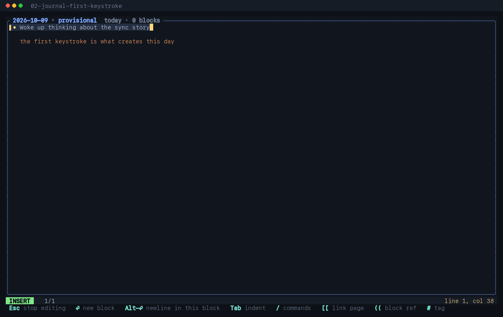 | 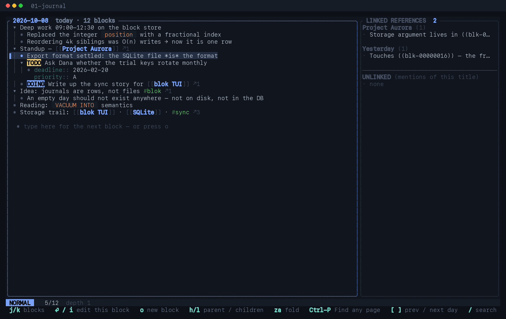 |

Note the title bar: `PROVISIONAL` on the left frame disappears on the right, and
the ghost block is the whole story. The storage screen shows the
prune pass with the days it dropped (`dumps/png/17-prune-empty-journals.png`).

**Design consequence worth stating:** because empties never persist, "yesterday"
in Find is a list of *written* days, not a calendar. A 40-day gap is four
lines, not forty.

---

## 5. Backup and sync: the file is the protocol

### What is implemented

* `Db::backup_snapshot()` runs `VACUUM INTO '<dir>/blok-YYYYmmdd-HHMMSS.sqlite'`,
  which SQLite guarantees is a **consistent, compacted, single-file snapshot**
  even while the app is running, then records it in `backup_log` (file, bytes,
  timestamp, remote, state).
* `Db::queue_remote_upload()` writes the descriptor that the uploader consumes —
  in the real thing, `rclone copy --checksum <snapshot> dropbox:Apps/blok` — and
  flips the log row to `uploaded`.
* Ctrl-S anywhere runs the snapshot and drops you on the storage screen; the
  status bar's `snapshot: never / ok` badge is driven by `backup_log`.
* `PRAGMA wal_checkpoint(PASSIVE)` runs before each stats pass, so sizes on the
  storage screen reflect a compacted file and not a fat WAL.

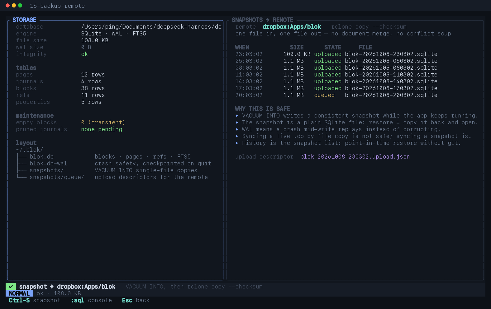

### Why not sync `blok.db` itself

This is the part that deserves to be argued rather than assumed:

* In WAL mode the database is **three files** (`.db`, `-wal`, `-shm`). Any
  file-sync tool that copies `blok.db` alone is capturing an inconsistent view.
* Copying a database while a transaction is active can capture "some old and some
  new content"; a stale hot journal or a missing `-wal` sidecar breaks automatic
  recovery. SQLite's own *How To Corrupt An SQLite Database File* lists exactly
  these as corruption causes.
* Network filesystems (NFS, and by extension some sync mounts) break POSIX
  advisory locking, which is the only thing keeping a second writer out.
* A **WAL-reset race** corrupted databases in SQLite releases from 3.7.0 through
  3.51.2 under concurrent writers — i.e. "it has always worked for me" is not
  evidence.

So blok's rule is: **one writer, WAL, and the syncable artifact is a snapshot.**
The snapshot is a plain SQLite file, so restore is `cp snapshot.sqlite
~/.blok/blok.db` — no export, no import, no merge. For machines that need to
converge live, `sqlite3_rsync` (SQLite 3.47+, 2024-10-21) is the right tool: it
performs a consistent copy of a *live* database over SSH. A future op-log layer
is the only way to get true multi-writer merge, and that is explicitly a
milestone, not a claim.

### The rest of the durability story

| Risk | Mitigation |
|---|---|
| Crash mid-write | WAL replay. `synchronous=NORMAL` in WAL is safe for app crashes (an OS crash can lose the last commit; `FULL` is a config toggle). |
| Bad edit | Soft deletes + `u` undo; snapshots give point-in-time restore. |
| Corrupt file | `PRAGMA integrity_check` is shown on the storage screen and in `--stats`. |
| Wrong device | Snapshots are timestamped and retained (`settings.snapshot_keep`, default 30). |
| Silent index drift | FTS5 is external-content and rebuildable; search falls back to `LIKE` if FTS5 is unavailable in the build. |

---

## 6. The screens

Frames are 140×42 cells (the compact one is 80×24); the PNGs are rasterised at
11×22 px per cell.

### 6.1 Journal — the front door


There is **no top bar and no page sidebar**. Both were removed after using the
thing: the top bar repeated the pane title, the date, a `TODAY` badge and four
counters that nobody navigated by, and the sidebar was a page tree that made you
find a pane before you could go anywhere. What is left is the outline, its title,
and one status line.

* **The pane title is the context:** `2026-10-08  today · 12 blocks`, or a page
  name, or `2026-10-09 · provisional` for a day that has not been written to.
* **The outline:** indent guides (`│`), fold markers (`▾`/`▸` with a child count
  when collapsed), bullets, and inline syntax: `[[links]]` in accent, `((refs))`
  in purple *resolved to a snippet of the target*, `#tags` in green, `key:: value`
  cyan keys, `TODO`/`DOING`/`DONE` badges, `` `code` `` on a raised background,
  `**bold**`, and `↗N` on any block that contains links.
* **Right (`Ctrl-M`, hidden by default) — PAGE METADATA:** what the page *is*
  (kind, created/updated, block count, links in/out, and any `key:: value`
  properties on a top-level block), then the linked references grouped by source
  page, then unlinked mentions of the title that are not yet linked. Asking for
  the panel and the panel being useful are the same gesture.
* **Bottom:** mode chip, caret state, pending operator, and the cursor's position
  in the outline (`5/12`), then the contextual hint bar.

### 6.2 Page view and links

| Page | Page metadata (`Ctrl-M`) |
|---|---|
| 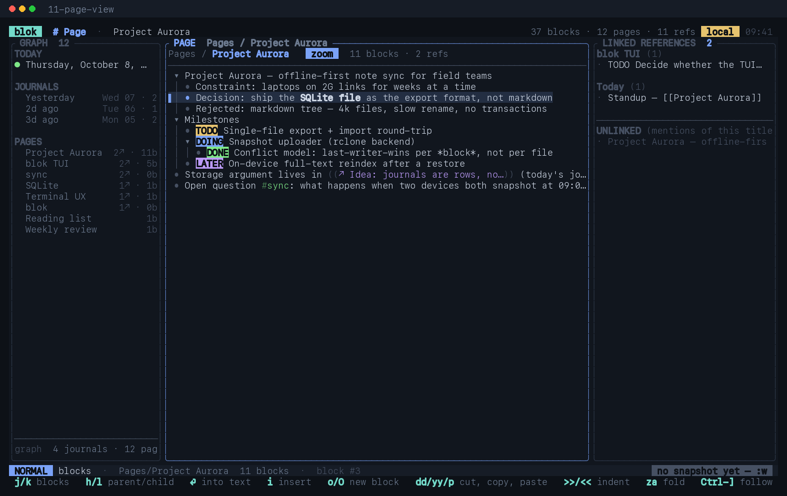 | 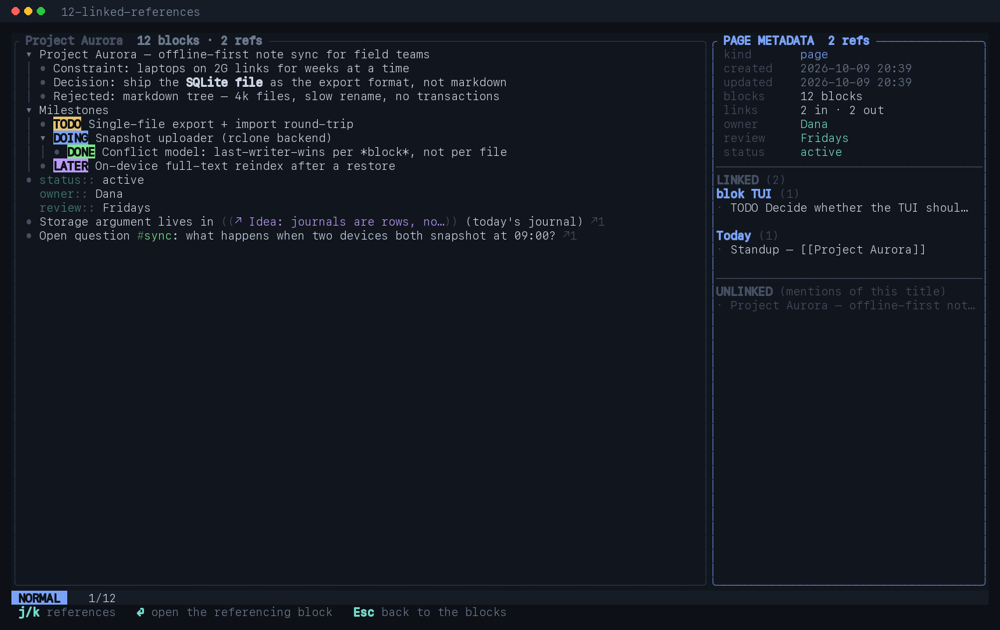 |

The same outliner, titled with the page name. The metadata panel shows the page's
facts above its backlinks — here `kind page`, `12 blocks`, `2 in · 2 out`, and the
`owner::`/`review::`/`status::` properties it inherits from a top-level block.
`Ctrl-w l` focuses it once it is visible; the focused pane's border and section
title change colour, and the selected reference gets a `▸` marker (selection is
never carried by colour alone — it has to survive a monochrome terminal).

### 6.3 Slash commands, page links, block refs

| `/` commands | `[[` page link | `((` block ref |
|---|---|---|
| 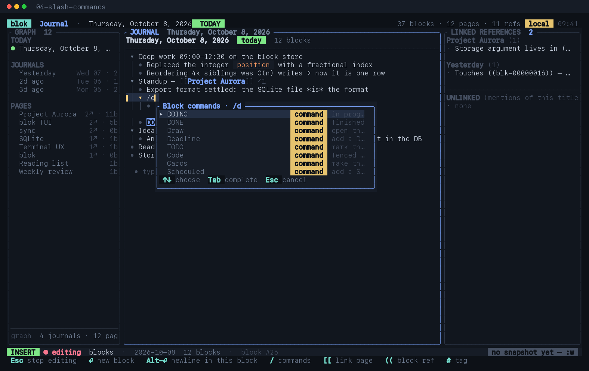 | 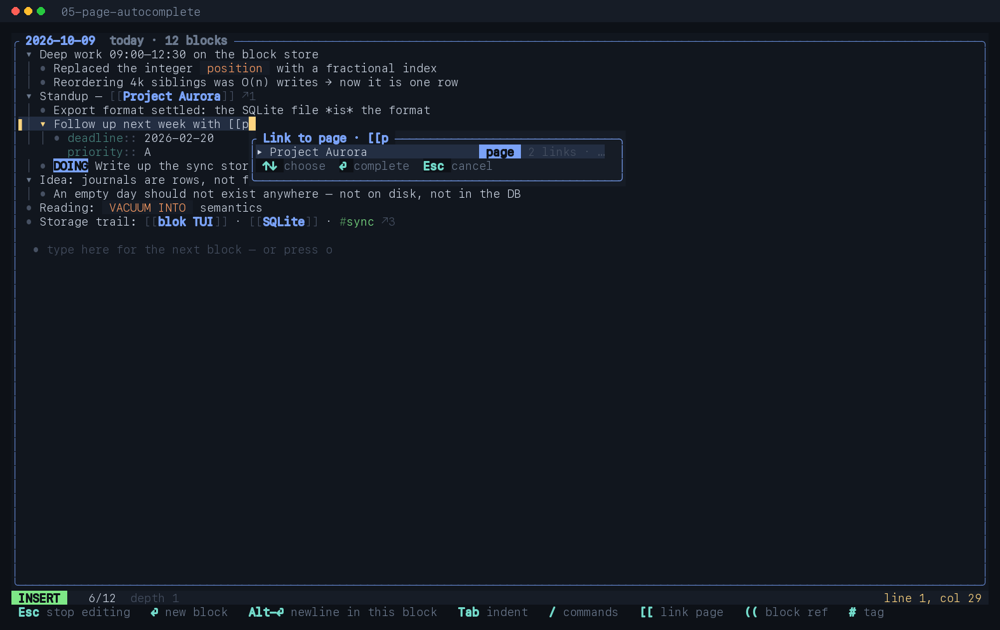 | 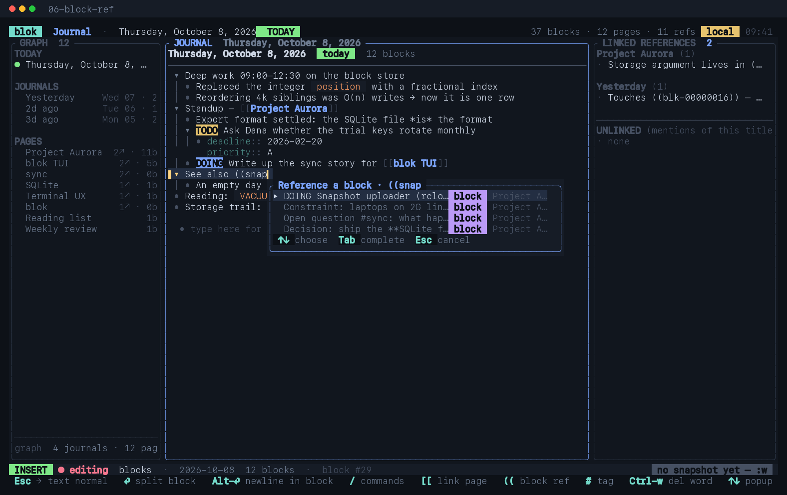 |

All three popups are anchored to the caret, open on the trigger character, fuzzy-
filter as you type, and accept with Tab/Enter. Block refs show the *resolved
snippet* of the candidate, so `((` is a search over your own writing rather than
a uuid-paste exercise. In the outliner, a rendered block ref shows
`((↗ snippet…))`: the uuid is never displayed unless you ask for it.

### 6.4 Search, board, storage, help

| FTS5 search | TODO board |
|---|---|
| 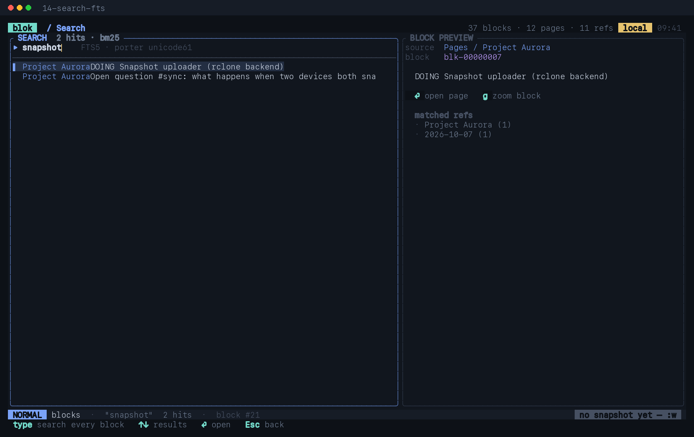 | 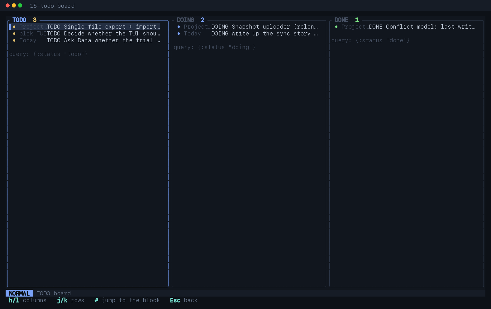 |

Search is `blocks_fts MATCH '"snap"*'` ordered by `bm25()`, with the preview pane
showing the source page, the block uuid and its backlinks. The board is the same
data through `WHERE status = ?` — because the marker is mirrored into a column,
the "query" costs nothing.

| Storage & backup | Keymap |
|---|---|
| 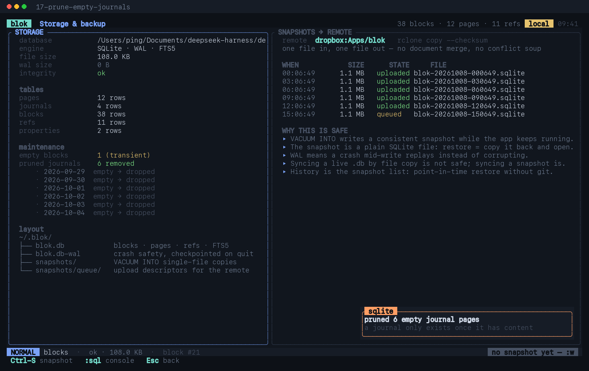 | 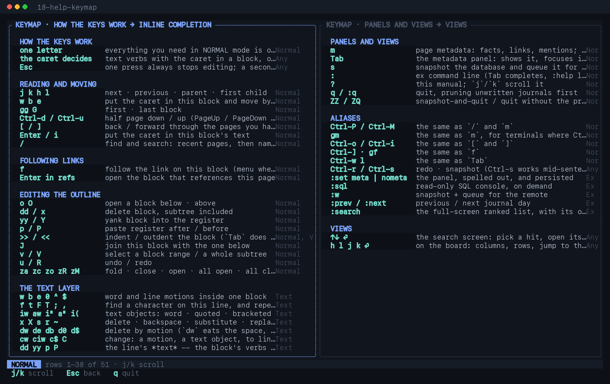 |

### 6.5 Find, and 80×24

| Palette | Compact |
|---|---|
| 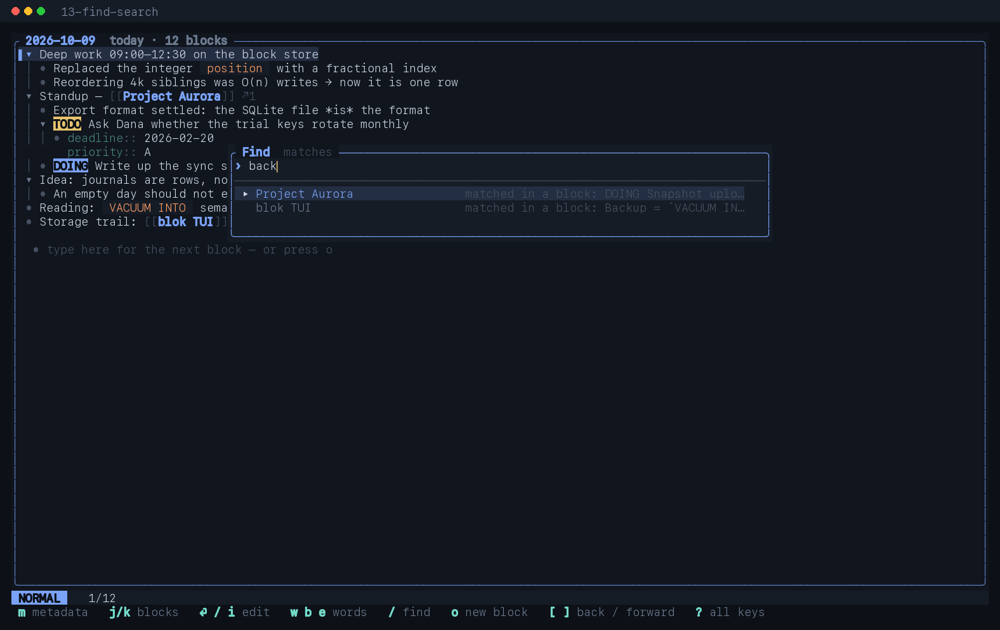 | 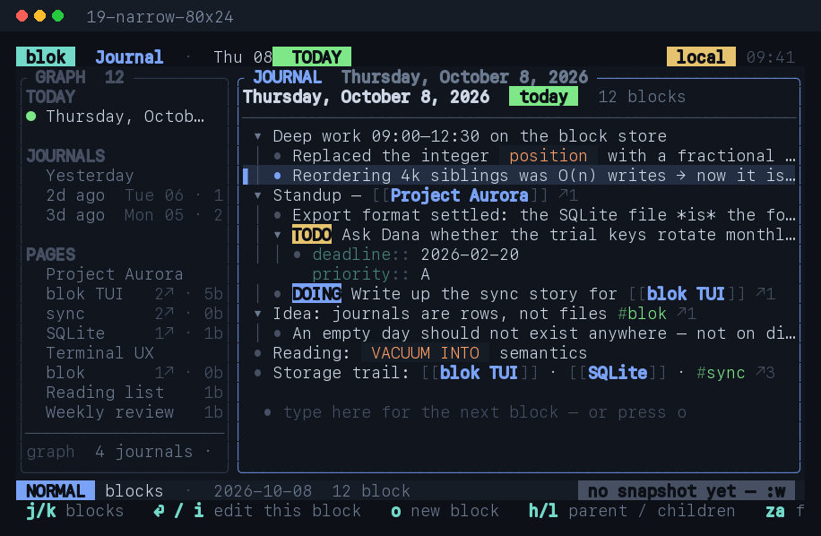 |

At 80 columns the references pane steps aside (not squeezed) and the hint bar
truncates — the same code path, no separate "small screen" mode. The outline is
the whole window at every width, which is the point of deleting the chrome.

### 6.6 Navigation, panels, and where the internals went

Four screens that came out of *using* the thing rather than drawing it.

**Following links** (`Ctrl-]` or `gf`). A block's links were visible but not
traversable — the single worst omission in the first version, and it took two
passes to actually fix. Following one is now discoverable three ways over: the
block is marked `↗N` in the outline, the hint bar for that block leads with
"Ctrl-] follow N links", and `Ctrl-]`/`gf` opens the chooser when a block holds
several. `Ctrl-o` / `Ctrl-i` walk the jumplist, which is vim's tag-stack
behaviour. A page that does not exist yet reads `new page` rather than failing.

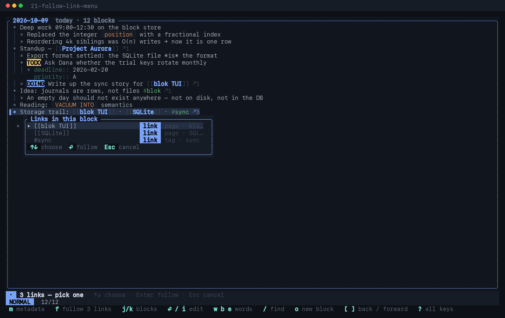

*Each candidate is resolved and labelled: a page that exists, a tag, or a block
ref shown with its target's text.*

**The caret inside a block.** `Enter` puts the caret in the text without changing
mode; word and line motions work there, and any tree motion leaves it. One
`Esc` from typing always returns to NORMAL (see §7.5 — this part was two modes
and a three-step ladder in the previous revision, which was a design error).

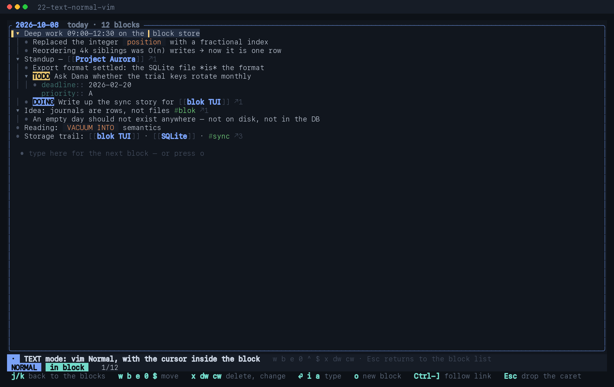

**The `:` command line**, with completion, so app-level actions stop claiming
letters that vim owns and the whole surface stays discoverable.

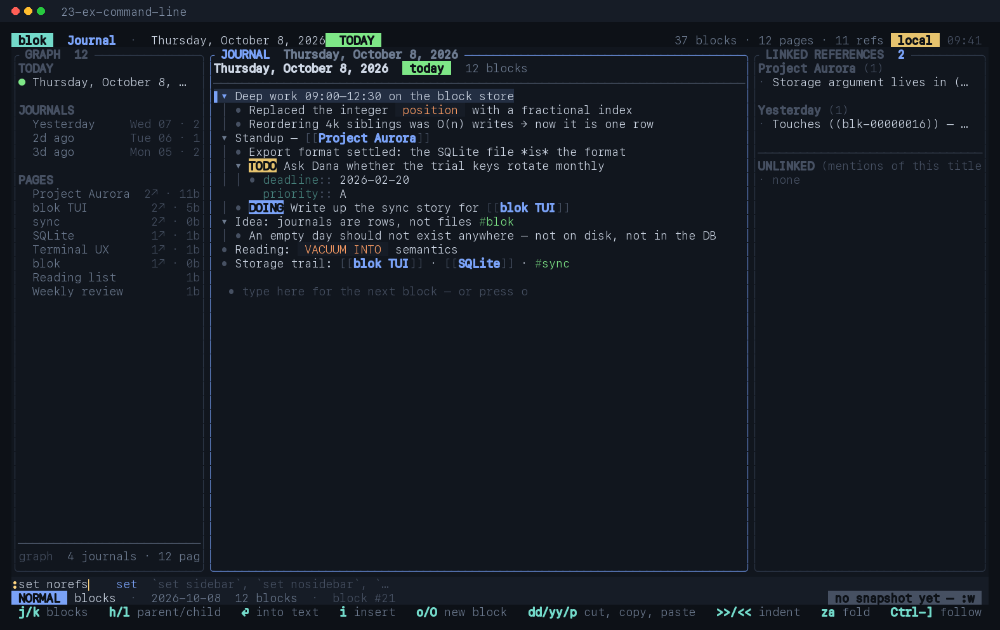

**The SQL console** (`:sql`), read-only and on demand — the answer to "the
database detail in the status bar is confusing". It is not in the status bar
anymore; it is one command away, and it is where you go when a backlink is
missing, a snapshot did not upload, or the schema is not what you think.

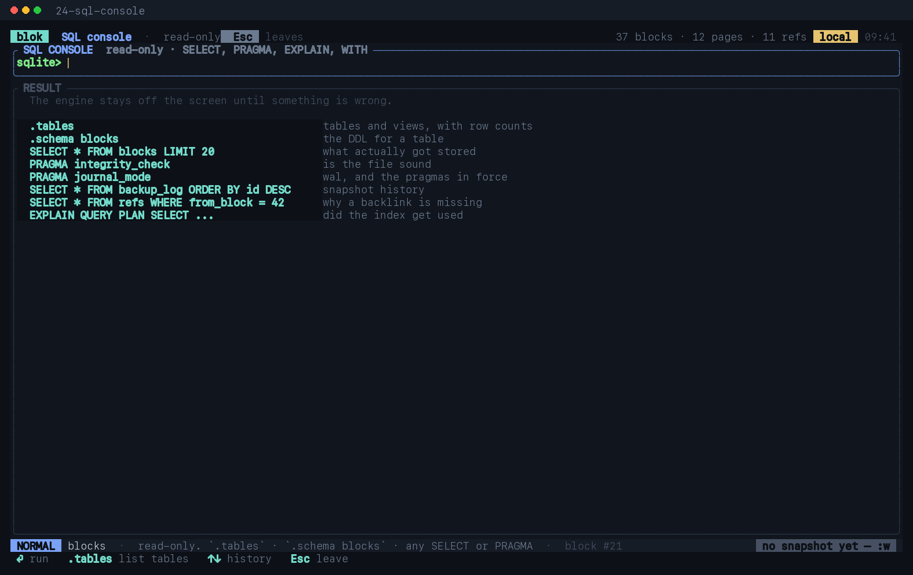

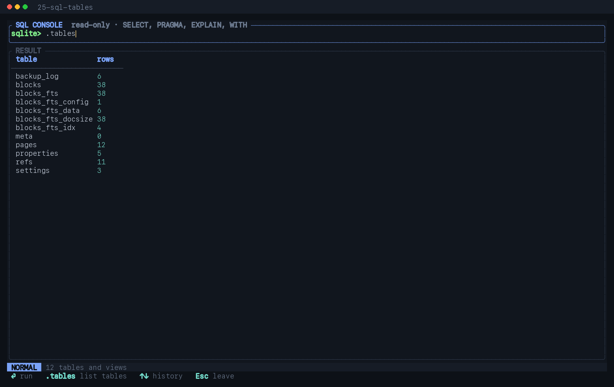

**A terminal caveat, handled rather than hidden.** `Ctrl-M` is the same byte as
`Enter` (`0x0D`) under the legacy terminal encoding, which is why the first
attempt at this binding simply started editing the block. blok now asks the
terminal to disambiguate those keys at startup (the kitty keyboard protocol's
`DISAMBIGUATE_ESCAPE_CODES`, via crossterm); where the terminal agrees — kitty,
WezTerm, foot, Ghostty, tmux 3.3+ with `extended-keys on` — `Ctrl-M` arrives as
itself and the hint bar says `Ctrl-M`. Where it does not, `Ctrl-M` is
indistinguishable from Enter and the hint bar says `gm` instead, because
advertising a key that edits the block is worse than advertising a two-key
sequence. The same negotiation fixes the other four collisions in this family:
`Ctrl-I`/Tab, `Ctrl-H`/Backspace, `Ctrl-[`/Esc and `Ctrl-J`/Enter. `gm` and
`:set meta` work everywhere.

**Page metadata** (`Ctrl-M`) is off by default and the hint bar advertises it
(`Ctrl-M page metadata`), so a hidden panel is an invitation rather than a
mystery. It persists in `settings`, and `:set nometa` turns it off.

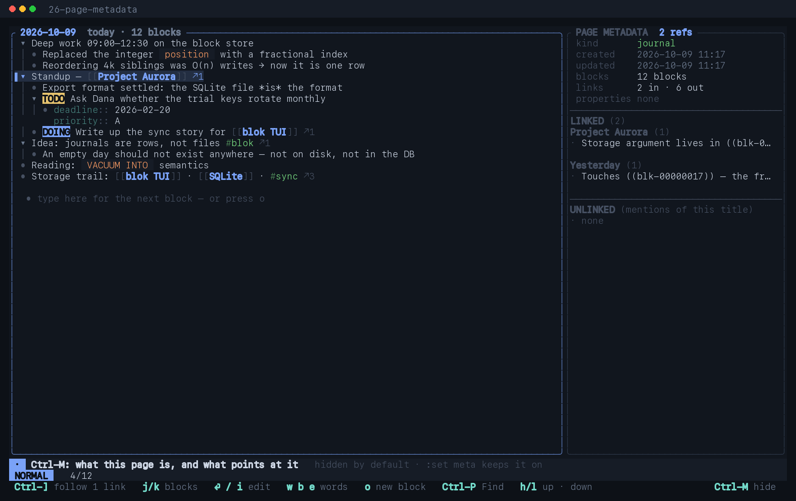

**Find** (`Ctrl-P`) is the navigation. With no query it lists what you touched
last — journals by relative date, pages by recency, each with its most recent
block as a preview — so "the thing I was writing yesterday" is two keys away.
Type and it becomes a search across page **names** and block **text**; a content
hit says `matched in a block: …` so you can see why it matched, and `⏎` lands on
that block rather than on the top of the page.

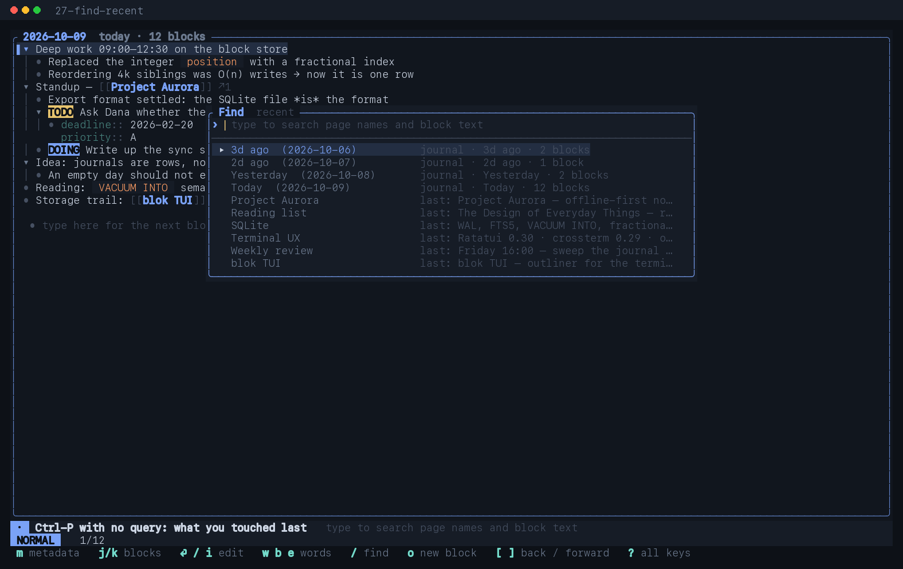


**Messages, not dialogs.** The previous revision drew the last action in a
floating box in the bottom-right corner, titled `sqlite`, which read as a
database dialog. It is now one line above the status bar, cleared by the next
keypress, with no title at all.

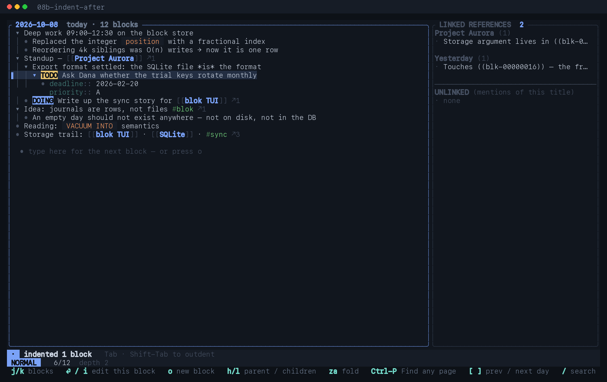

---

## 7. Block editing in a terminal

This is the part that makes or breaks a TUI outliner, so it gets its own
section. The editor is one block at a time, embedded in the outline — **not** one
big text buffer for the page (that fights folding, per-block uuids and cursor-in-
block semantics).

### 7.1 The caret and the position readout

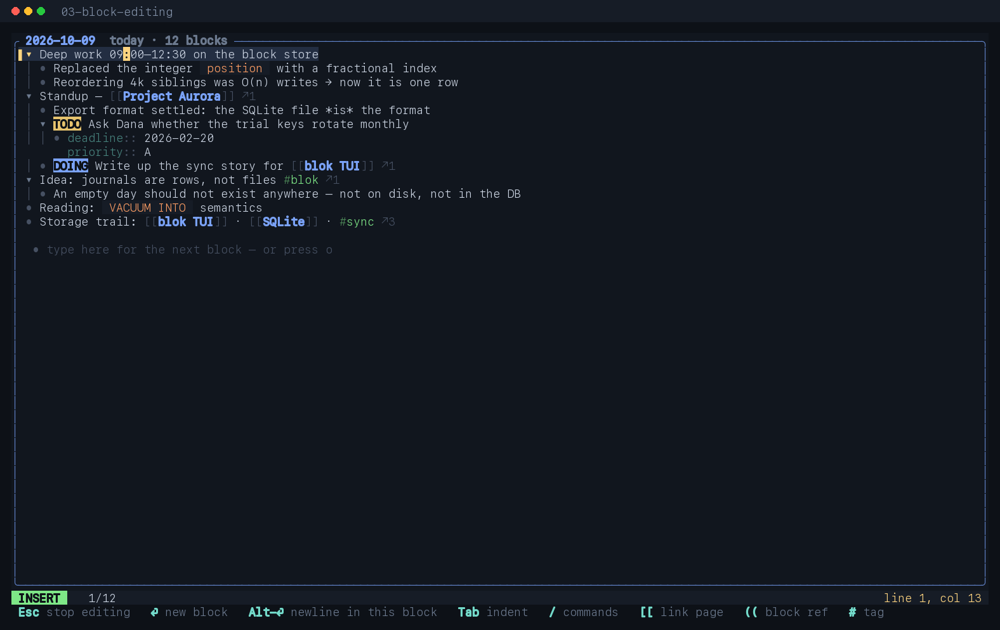

The block under the caret is rendered with a hot background (`▌` marker, raised
line background) and the caret is drawn *inside the text* as `▏`, between `09`
and `:00` above: the cursor is a character index, and the line is soft-wrapped
underneath it.

**This paragraph used to be false.** It claimed the caret *was* the hardware
cursor, placed with `Frame::set_cursor_position()`, and that `fake_caret` existed
only so a screenshot kept it. Nothing ever called `set_cursor_position`, and the
glyph was drawn only when `fake_caret` was set — which only the mockup dumper
did. So in a real terminal there was no caret at all: it was visible in the
frames and nowhere else, which is the worst place for a cursor to be visible.
Both halves are now true and both are tested: the terminal cursor is placed at
the caret cell, and the glyph is drawn there too, so a dump is faithful and a
terminal that would rather not blink still shows where typing goes.

**Position, in words.** The right end of the status bar carries vim's ruler for
the block being edited — `line 2, col 5` — because "where is my cursor" is a
question a TUI should answer without decorating it. It is blank when the caret is
in the tree: the row highlight and the `7/12` count are the tree's position
indicator, and the hardware cursor stays out of a list it would only blink on.
The ruler counts the block's own lines, not the visual ones: soft wrapping is a
display detail and does not move it, exactly as in vim.

Mechanics:

* **Soft wrap.** `wrap_ranges()` produces `(start, end)` char ranges, breaking at
  spaces where possible; the block's text is never rewritten. `↑`/`↓` in the real
  app move by *visual* line, and the caret's screen position is recomputed from
  the range that contains `cursor` — including the two cases that are not
  "inside a range": a cursor *on* the newline that ends a line, and a cursor past
  the last character. Both used to fall through the placement branches and leave
  the caret at the start of the block, pointing at a line it was not on.
* **Every rendered line fits the pane, and the caret's cell is reserved.** The
  `Paragraph` that draws these lines wraps on *word* boundaries, so one cell of
  overflow does not clip — it moves a whole word to the next display row, and
  every row below it shifts while the caret keeps its old idea of the row. So
  `wrap_ranges` gets one cell less than the pane (the caret's own cell), and the
  `↗N` link marker and `▸ N collapsed` badge are subtracted from the text width
  instead of being appended past it. `no_line_is_wider_than_the_pane` renders
  every cursor position of two long blocks at four widths and checks each line.
* **Styles carry through editing.** The same `styled_chars()` pass feeds both the
  read-only outline and the editor, so `[[links]]`, `((refs))` and `#tags` stay
  coloured while you type them; there is one parser, not two.
* **Multi-line blocks.** Alt-⏎ inserts a real `\n` inside the block. Continuation
  lines hang under the *text*, not under the bullet (see the properties frame
  below) — which is also how `key:: value` property blocks are laid out.

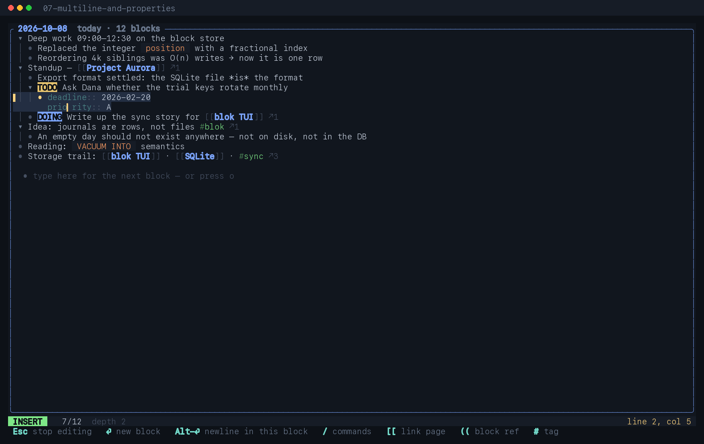

That frame is also where the ruler earns its place: the caret is on the *second*
line of the block, so the status bar reads `line 2, col 5` while the block index
on the left still says `7/12`. Two different questions — where in the page, where
in the block — two different numbers, and neither is an approximation.

### 7.2 Structure edits

| Action | Keys | Semantics |
|---|---|---|
| New block below | `o` | sibling after the current block; children stay with the parent |
| Split at caret | Enter (mid-text) | head stays, tail moves to a new sibling, children stay on the head |
| New sibling | Enter (at end) | empty block beneath, still in insert mode |
| Merge upward | Backspace (empty block) | text is appended to the previous sibling; **children are re-parented to it** |
| Indent | Tab | adopt the previous sibling as parent (one row: `parent_id`, `position`) |
| Outdent | Shift-Tab | become the sibling right after the parent (`position = parent.position + 0.5`) |
| Reorder | Alt-↑/↓ | swap `position` with the neighbouring sibling |
| Fold | `z` / `Z` | `collapsed` is per block; a collapsed node shows `▸ 3 collapsed` |
| TODO | Ctrl-⏎ | cycles TODO → DOING → DONE → none, writing the marker into the text *and* `blocks.status` |

| Before Tab | After Tab |
|---|---|
| 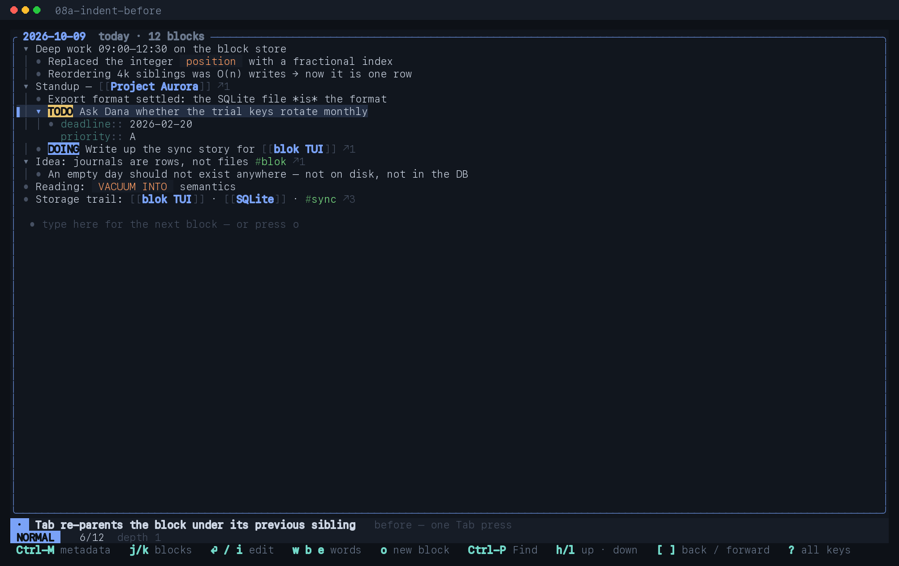 |  |

| Empty block just created | After Backspace at its start |
|---|---|
| 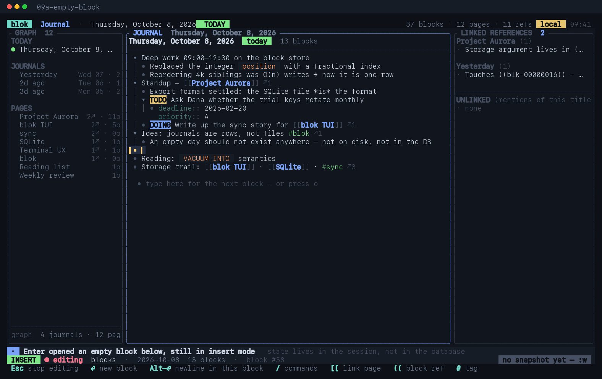 | 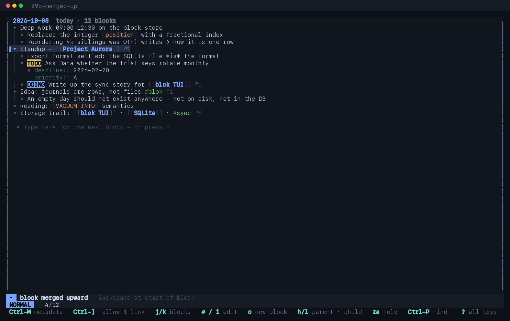 |

An empty block that is never filled in is a *session* artifact: it is not
special-cased in the database, it is simply an empty row that the next save pass
would drop, and the storage screen counts it ("empty blocks: 1 (transient)").

### 7.3 Visual mode: batching structure edits

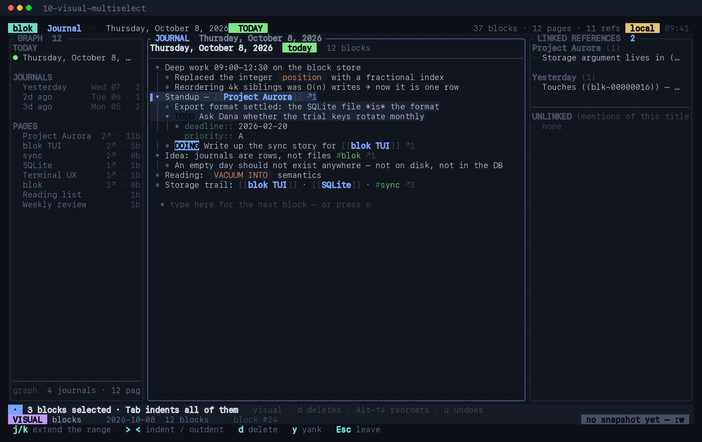

`v` anchors a selection; the anchor-to-cursor range is tinted (subtly — the tint
has to be visible without competing with the `TODO` badges), and the structural
verbs apply to the whole range: `>` re-parents all of them under the first
block's previous sibling, `d` soft-deletes them, `u` restores. `V` selects a
whole subtree (a subtree is contiguous in the flattened rows). This is the
terminal-native answer to dragging a subtree with a mouse.

### 7.4 Undo

`u` pops an `UndoOp`, `Ctrl-r` pushes it back:

```rust
enum UndoOp {
    Content { id, old, new },
    Created { id, page_id, parent, content },
    Deleted { id, page_id, parent, position, content, subtree },
}
```

Content edits restore the previous text; creations soft-delete; deletions carry
enough to come back — including the whole yanked subtree — so `u` after `dd` on a
parent of eight children restores nine blocks, and `Ctrl-r` removes them again.
In the full app this becomes an op log, which is also what a multi-writer sync
would replay; `outl`'s lesson is that **fold state belongs in that log** (so folds
converge) while **zoom belongs to the client** (so it never syncs). blok keeps
`collapsed` in the row for now and notes the split.

### 7.5 Vim conformance, and the one place an outliner bends it

The brief was "editing should follow VIM convention completely". The only real
conflict is that vim's model is *lines in a file*, and here the unit is a
**block** which may itself contain lines (Alt-⏎). An earlier revision resolved
that with a second Normal mode (`TEXT`) and a three-step ladder. **That was a
mistake and it has been removed**: two Escapes to get out of editing reads as a
stuck app, and a mode chip that says `TEXT` explains nothing.

There are **three modes**, and the caret is a *position*, not a mode:

```
NORMAL  ── i a I A o O cc ──▶  INSERT
   ▲                              │
   └────────────  Esc ────────────┘      one Escape. Always.
```

* `NORMAL` — the block list. `j`/`k`/`gg`/`G` move, operators (`dd`, `yy`, `p`,
  `>>`, `J`, `cc`) act on subtrees. The caret can additionally sit *inside* the
  selected block's text (press `Enter`, or arrive there by leaving INSERT). While
  it does, vim's text grammar applies — `w b e 0 ^ $`, `x`, `dw`, `d$`, `cw`,
  `C` — and **any tree motion leaves the text first**: `j` is enough. That is the
  difference between a cursor sub-state and a mode: you cannot get stuck in it.
* `INSERT` — typing. `Esc` returns to NORMAL with the caret still in the block.
* `VISUAL` — `v` a range of blocks, `V` a whole subtree, with `>`, `<`, `d`,
  `y`, `J`, `K`.

The status bar shows a small `in block` chip while the caret is in text, and the
hint bar changes to say so — `j/k back to the blocks` is the first thing it
offers. Its right end then carries the caret's `line, col` inside that block
(§7.1), which is the one piece of state a vim user expects to be able to read off
the bottom of the screen.

**Following links.** `Ctrl-]` (and `gf`) behave like vim's tag jump, with
`Ctrl-o`/`Ctrl-i` walking the jumplist. A block that contains links is marked
`↗N` in the outline, and the hint bar for a block with links leads with
"Ctrl-] follow N links" — so a link is a visible destination rather than a
decoration you have to guess about.

**The deviations, all five of them:**

1. `hjkl` navigate the tree, because there is no document to navigate.
2. `Enter` puts the caret in the block's text instead of moving down a line —
   down a line is `j`, since a line is a block.
3. `J` joins a block with the *next block*, which is `J` with blocks as lines.
4. `?` opens the keymap rather than searching backwards; `/` then `N` covers that.
5. App-level commands live in `:` (`:e`, `:w`, `:set`, `:sql`, `:board`, `:m +1`)
   rather than on new letters — which is also how vim keeps its namespace clean.

Undo (`u`/`Ctrl-r`) and the pending-prefix indicator in the status bar (a `d`
shows a `d` chip until the operator is complete) are the other two places where
vim's grammar is made visible rather than assumed.

---

## 8. Keymap

`?` opens the two-column reference; the single source of truth is `KEYMAP` in
`src/app.rs`, rendered verbatim by the help screen. The table:

| Keys | Action |
|---|---|
| `i` `a` `I` `A` | insert · append · line start · line end |
| `o` `O` | open a block below / above and insert |
| `cc` | change the block (clear it, then insert) |
| `Esc` | **one press always stops editing**; a second drops the caret |
| `Enter` | put the caret *in* the block's text (still NORMAL) |
| `j` `k` `h` `l` | next · previous · parent · first child block |
| `gg` `G` `Ctrl-d` `Ctrl-u` | first · last · half page down · half page up |
| `[` `]` | previous / next journal day |
| `Ctrl-P` | **open any page**: page/journal picker, filter as you type |
| `Ctrl-w l` | focus the metadata panel (once shown) |
| `Ctrl-]` or `gf` | follow the link on this block (menu when there are several) |
| `Ctrl-o` `Ctrl-i` | jump back / forward (vim's jumplist) |
| `Enter` (references pane) | open the block that references this page |
| `dd` `x` | delete the block, subtree included |
| `yy` `Y` | yank the block into the register |
| `p` `P` | paste the register after / before |
| `>>` `<<` (or `Tab`, `Shift-Tab`) | indent / outdent |
| `J` | join: merge this block with the one below |
| `u` `Ctrl-r` | undo / redo |
| `za` `zc` `zo` `zR` `zM` | fold · close · open · all open · all closed |
| `w` `b` `e` `0` `^` `$` | word and line motions, with the caret in a block |
| `x` `dw` `d$` `D` `cw` `ciw` `C` | delete / change, with the caret in a block |
| `Ctrl-w` `Ctrl-u` | delete word / to line start (INSERT) |
| `v` / `V` | select a block range / a whole subtree |
| `>` `<` `d` `y` `J` `K` | indent, delete, yank, reorder the selection (VISUAL) |
| `:` | ex command line, Tab-completed |
| `/` `n` `N` | search the graph · next · previous match |
| `Ctrl-M` | show / hide page metadata (facts, links, mentions) |
| `Ctrl-S` | snapshot, then the storage screen |
| `q` `ZZ` `ZQ` `:q` | quit · snapshot-and-quit · quit without pruning · quit |
| `:w` `:q` `:q!` `:e` `:set` `:sql` `:board` `:storage` `:prune` `:m` `:search` | see `EX_COMMANDS` |
| `?` | the keymap |

**The deviations, stated rather than glossed** (also in §7.5):

* `hjkl` navigate the *tree*, not a document — there is no document.
* `Enter` moves the cursor into the block's text in Normal mode rather than down
  a line, because moving down a line is already `j` (a line is a block).
* `J` joins a block with the block below, which is vim's `J` with blocks as lines.
* `?` opens the keymap instead of searching backwards; `/` + `N` covers that.
* Page-level things that vim does not have (`[`/`]`, `Ctrl-M`, `Ctrl-P`, the
  views) are bound to keys vim leaves alone, and everything else is a `:` command
  rather than a new letter.

Deliberately not bound: mouse capture (off, so terminal selection works),
`Ctrl-Z` (left to the shell — `outl` has a documented bug where a fold chord
shadows undo, and this is how blok avoids inheriting it).

---

## 9. Rendering notes

* **Indent guides, capped by design.** Ancestor levels draw `│ ` or two spaces
  depending on whether that ancestor was the last of its siblings, so the tree
  stays readable at depth. Past ~6 levels the guides cost more width than they
  buy; the roadmap item is to collapse them to a depth marker.
* **Fold markers are fixed-width.** `▾`/`▸`/`•` are always one cell, so text
  never shifts horizontally when a subtree folds. Collapsed nodes append
  `▸ N collapsed` so you never have to guess what is hidden.
* **Glyph discipline.** Every symbol is verified against a stock monospace font
  (`SFNSMono`, `Menlo`, `Andale Mono`); the ones that rendered as blank tofu
  (`⌂ ⛁ ▦ ⌕ ↵`) were replaced with text or with verified glyphs (`⏎ ▶`). This is
  why there are no Nerd Font icons: a missing glyph in a terminal is not a
  cosmetic issue, it is missing information.
* **Colour with a floor.** State is never colour-only: selection has `▌`/`▸`,
  task state has a badge with the word in it, snapshot state has a word. The
  palette is 24-bit RGB (`src/theme.rs`) and every panel has an explicit
  background, so the app looks the same on a light terminal as on a dark one.
* **Width honesty.** The wrap and truncation maths use ratatui's
  `Line::width()` (unicode-width) rather than `char::count()`; the known gap is
  CJK width inside the *editor's* wrap ranges, which is a roadmap item. A second
  known gap: at the pane's floor (8 columns) with a deep indent, the indent
  prefix alone can exceed the width and a line still cannot fit — there is no
  horizontal scroll, so the honest answer there is "do not go that narrow that
  deep", not a claim that it works.
* **The cursor is placed, not implied.** `render()` sets the terminal cursor for
  whichever input is on top — the block editor, the Find prompt, the `/` prompt,
  the `:` line, the SQL console — using the same arithmetic that draws the `▏`
  glyph, so the two can be tested against each other
  (`every_input_puts_the_cursor_on_its_caret`). A position that has scrolled out
  of its pane is dropped rather than clamped to the edge, which would point at
  the wrong cell. In an empty Find box the caret now sits *before* the
  placeholder text instead of at the end of it.

---

## 10. Feature coverage vs Logseq's top-20

Statuses: **built** = working in the prototype, **partial** = the mechanism is
there but the surface is thin, **roadmap** = designed, not written, **dropped** =
deliberately out of scope, **gap** = a real hole. The ranked list is from
`../research/logseq-value-proposition.md`.

Note the revisions after the second round of feedback: link *traversal* (`Ctrl-]`)
moved #4/#5 from decoration to navigation; vim conformance (#3, #13) went from
"partial" to built; and the side panels and the status bar were demoted from
permanent furniture to toggles (§2, decisions 8-9).

| # | What users value in Logseq (ranked) | blok | Status |
|---|---|---|---|
| 1 | Local-first storage and data ownership | A SQLite file you own; no account, no network in the loop. But *not* plain text — that trade is §5, and it is the one place blok deliberately breaks from the top-ranked property | **partial** (deliberate) |
| 2 | Journal-first daily notes that name themselves | Opens on today; provisional until the first keystroke; pruned if never written | **built** |
| 3 | Block-level outliner with zoom | `blocks` table; fold/indent/split/merge/reorder. **Zoom** (a block as the whole view, with breadcrumb) is roadmap | **partial** |
| 4 | Block references `((uuid))` + transclusion | `((uuid))` popup, refs rows, snippets resolved inline; rendering the target's *children* (true transclusion) is not done | **partial** |
| 5 | Bidirectional links + Linked/Unlinked References | `refs` rows; LINKED REFERENCES pane grouped by source, plus unlinked-mention candidates | **built** |
| 6 | Open source / AGPL | Prototype has **no LICENSE file yet** — a one-line fix, but it is a real gap in the deliverable | **gap** |
| 7 | Queries (simple, builder, Datalog) | `status` column + live board columns; no query language or builder | **partial** |
| 8 | Built-in task management | Ctrl-⏎ cycles markers into the text and mirrors `blocks.status`; `SCHEDULED::`/`DEADLINE::` are stored as properties but not yet resurfaced on the journal | **partial** |
| 9 | Properties and page/block metadata | `properties` table; `key:: value` rendered with cyan keys | **built** |
| 10 | Everything is a page (`#tag` == `[[tag]]`) | `#tag` → `pages` row + refs | **built** |
| 11 | Templates and slash commands | Inline `/` menu works; template *expansion* is not implemented | **partial** |
| 12 | Namespaces (`parent/child`) | `[[a/b]]` stores as a flat name; no parent tree, no namespace rendering | **roadmap** |
| 13 | Refactoring and block manipulation | Keyboard equivalent of drag: indent/outdent (fractional index, one row), Alt-↑/↓ reorder, visual multi-select; no mouse | **built** (keyboard) |
| 14 | PDF annotation built in | — | **dropped** |
| 15 | Plugin ecosystem and marketplace | Find + stable uuid handles as the extension seam; no plugin runtime | **roadmap** |
| 16 | Publishing a graph | `--export html` is on the roadmap (§12) | **roadmap** |
| 17 | Sync, self-managed or official | Snapshot + remote copy (single writer); no client-side encryption, no multi-writer merge | **partial** |
| 18 | Aliases | `alias::` → extra `refs` rows is a small, well-defined next step | **roadmap** |
| 19 | Whiteboards / spatial canvas | — | **dropped** |
| 20 | Flashcards / spaced repetition | Slash menu has a `Cards` entry; no scheduler (SM-2 over `#card` blocks is cheap) | **roadmap** |

The honest summary: blok is deepest where the research says the *affection* lives
(2, 5, 9, 10) and where the structure verbs are (3, 13, 8 partly). It is
deliberately *different* on #1 — local-first yes, plain text no — which is the
single biggest product bet in this document and the one most worth arguing about.
Everything that needs a GUI (14, 19), a browser (15, 16) or another device (17's
hard half) is out or unbuilt, and #6 is an outright gap: no license.

---

## 11. What is real, and what is mocked

Being explicit about this matters more than the demo looking good.

**Real, exercised by the dump run and the CLI:**

* The SQLite schema, migrations, WAL, foreign keys, and soft deletes.
* FTS5 external-content indexing with triggers, bm25 ranking, and a `LIKE`
  fallback if FTS5 is missing (`--stats` prints which one is live).
* Reference extraction (`[[page]]`, `((uuid))`, `#tag`), page materialisation,
  `properties` rows, and the `TODO`-marker → `status` mirror.
* Journal lazy-materialisation, the provisional state, and the prune pass —
  `--demo-lifecycle` prints the trace above against a real database.
* Block operations: create, split, merge (with child re-parenting), indent,
  outdent, reorder, soft delete, fold, undo of the last three of those.
* `VACUUM INTO` snapshots while the database is open, `backup_log` history, the
  integrity check, and `wal_checkpoint` before measuring.
* Rendering is covered too: `every_view_draws_something` renders each view
  into a `TestBackend` and fails if one paints almost nothing. It exists because
  deleting the top bar shifted the layout and left Help and Storage drawing into
  the row that had become the one-line message area -- two frames were silently
  blank for two revisions, and only a screenshot review caught it.
* The caret is covered the same way: `the_caret_is_the_terminal_cursor_and_the_ruler_names_it`
  asserts the cursor's exact cell, that the glyph is under it, and that the ruler
  agrees; `the_caret_keeps_its_line_when_it_sits_on_a_newline` closes the
  fall-through above; `no_line_is_wider_than_the_pane` is the wrap invariant;
  `every_input_puts_the_cursor_on_its_caret` covers the other four input surfaces;
  and `the_tree_has_no_hardware_cursor` pins the deliberate omission, as does
  `the_cursor_follows_the_focus` for the editor left open behind the panel;
  `the_caret_shows_in_a_provisional_journal` covers the ghost first block, which
  is a separate render path.
* The key router is covered by 31 regression tests (`cargo test`), one per bug
  this project has actually shipped: `q`/`ZZ`/`ZQ`/`:q` all end the session and
  commit an in-flight edit; one `Esc` always leaves editing; a tree motion leaves
  the block's text; `dd` + `u` round-trips a block; `Ctrl-]` and `gf` both follow
  links; `Ctrl-P` opens Find, searches block text, and lands on the matching
  block; the metadata panel starts hidden, `Ctrl-M` shows it, and the choice
  persists; a message clears on the next keypress; the console refuses a
  `DELETE`.
* All 29 frames in this document are the app's own renderer (29 frames, 31
  tests -- the numbers are close enough to check twice, which is why they are
  spelled out rather than a round "about thirty").

**Mocked or stubbed (and flagged as such):**

* **The remote upload** writes the descriptor file an uploader would consume
  (`snapshots/queue/*.upload.json`); it does not talk to Dropbox. Wiring
  `rclone` into it is a small, boring change.
* **The graph census** (counts, not a force-directed drawing) went with the
  sidebar; `:sql` covers it for now.
* **`PRAGMA integrity_check`** is real, but the "restore" button is a documented
  `cp` — there is no restore UI yet.
* **Undo** covers text/create/delete, redo works, and a delete carries its whole
  subtree back. It is still not an op log, so it does not survive a restart and
  does not coalesce typing runs.
* **The SQL console** is a read-only *allow-list* (`SELECT`, `PRAGMA`, `EXPLAIN`,
  `WITH`, `.tables`, `.schema`) running on the app's own connection — a
  troubleshooting tool, not a security boundary.
* **Plugins, whiteboards, graph view, templates, zoom** — see §10.
* **Concurrency** is one writer by design. Two `blok` processes on one file will
  serialise through SQLite locking, not merge.

---

## 12. Roadmap

1. **Op log + coalesced undo** (`ops` table: `SetContent`, `Move`, `SetCollapsed`,
   `Create`, `Delete`), which makes undo durable *and* gives the sync layer
   something to replay.
2. **Zoom** (`zi`/`zo`) as client-local view state — never persisted, never
   synced, per `outl`'s split.
3. **`sqlite3_rsync` transport** plus a real remote backend, and snapshot
   retention enforcement from `settings.snapshot_keep`.
4. **Embedded editing widget** built on `tui-textarea-2`'s atomic ranges, so
   `[[refs]]`/`#tags`/`((uuids))` are indivisible tokens (a backspace can never
   corrupt a handle) with proper visual-line cursor navigation.
5. **CJK-correct width** in the editor's wrap and caret maths.
6. **Templates** with real expansion, and per-block `SCHEDULED::`/`DEADLINE::`
   surfacing on the journal (an agenda view is the natural next screen).
7. **Read-only publishing**: `blok --export html` as a static renderer, which is
   the cheap version of Logseq Publish.
8. **Cheap fidelity wins** for ranked features blok currently marks roadmap:
   `alias::` → extra `refs` rows (#18), namespace parents rendered as a small
   tree in the sidebar (#12), and SM-2 over `#card` blocks (#20).
9. **Pick a license** — the ranked list's #6 is open source, and this prototype
   has no LICENSE file. That is the user's call, not a design decision.
10. **Performance guardrails**: a 100k-block fixture in CI, asserting the fold
    flatten and FTS query stay under a frame budget.
